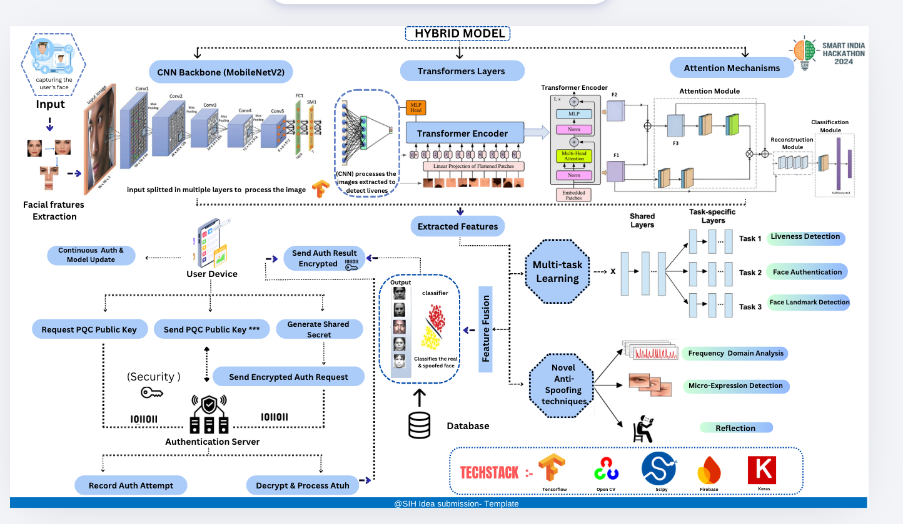

# 🔐 ASFA — Advanced Secure Face Authentication

[](https://python.org)
[](https://tensorflow.org)
[](https://flask.palletsprojects.com)
[](https://mongodb.com)
[](https://opencv.org)

A real-time face authentication web application combining **passive CNN-based anti-spoofing** with an **active challenge-response liveness check**, backed by MongoDB for user management. Built with Flask and a modern dark-themed glassmorphism UI.

---

## 🌟 What It Does

When a user attempts to authenticate:

1. **Anti-Spoofing (Passive)** — A custom-trained CNN (`antispoofing_full_model.h5`) analyses each camera frame for texture patterns characteristic of fake faces — printed photos, screen replays, or masks.
2. **Liveness Verification (Active)** — The user is prompted with random challenges (look left, look right, blink slowly, smile) detected via 68-point facial landmark analysis using dlib.
3. **Face Recognition** — Once the face passes both checks, it is matched against stored `face_recognition` encodings in MongoDB.
4. **Result** — A clear success, failure, or spoof-detected screen is shown with actionable guidance.

---

## 🏗️ Architecture



*Hybrid model combining a MobileNetV2 CNN backbone, Transformer encoder, and Attention mechanisms for multi-task learning across liveness detection, face authentication, and facial landmark detection. The pipeline includes Post-Quantum Cryptography (PQC) for encrypted auth requests and a novel anti-spoofing module using frequency-domain analysis, micro-expression detection, and reflection analysis.*

```
Webcam
  │
  ▼
Face Detection (Haar Cascade)
  │
  ├──▶ Anti-Spoofing CNN ──▶ Spoof? ──▶ 🚨 Deny + Explain
  │         (frame resized to 160×160, normalised /255)
  │
  ├──▶ Liveness Cue Verification (dlib 68-pt landmarks)
  │         └── look right / left / blink / smile (shuffled)
  │
  └──▶ Face Recognition (face_recognition encodings vs MongoDB)
            └── Match? ──▶ ✅ Grant Access
                       ──▶ ❌ Deny (up to N attempts)
```

---

## 🖥️ Web UI

Three-tab interface served at `http://localhost:5000`:

| Tab | Function |
|-----|----------|
| 🔐 **Authenticate** | Live camera feed, real-time status overlay, cue prompts, result banner |
| ➕ **Register** | Upload a photo + name to enrol a new user in MongoDB |
| 👥 **View Users** | List all registered users and their access levels |

**Spoof detected?** A persistent orange warning banner with a **"Try Authentication Again"** button stays on screen until the user dismisses it — they won't be accidentally timed out before they can read it.


---

## ⚖️ Dataset Bias & Fairness

Publicly available anti-spoofing benchmarks (e.g. MSU-MFSD, CASIA-FASD, Replay-Attack) are **heavily skewed** toward lighter skin tones and a narrow range of ethnicities, ages, and lighting conditions. Models trained solely on these datasets exhibit measurably higher false-positive rates for darker skin tones — a well-documented fairness problem in biometric AI.

To address this:

- **Custom dataset curated** — training data was sourced and balanced to include diverse skin tones, face shapes, and lighting environments, with deliberate over-representation of groups under-represented in standard benchmarks.
- **Per-subgroup metric tracking** — performance was evaluated per demographic subgroup during training, not only in aggregate, to surface and reduce disparate error rates.
- **Tunable thresholds** — `spoof_confidence` and `recognition_tolerance` are exposed as configurable parameters, allowing operators to calibrate FAR/FRR for their specific user population.

> Addressing fairness bias in biometric AI is an ongoing process. If you observe systematic errors for specific conditions, please open an issue.

---

## 🛠️ Tech Stack

| Layer | Technology |
|-------|------------|
| Web Framework | Flask (Python) |
| Computer Vision | OpenCV, face_recognition |
| Anti-Spoofing Model | TensorFlow / Keras (`.h5`, ~12 MB) |
| Facial Landmarks | dlib + `shape_predictor_68_face_landmarks.dat` |
| Database | MongoDB via pymongo |
| Frontend | Vanilla HTML/CSS/JS — dark glassmorphism theme |

---

## 🚀 Setup

### Prerequisites

- Python 3.8+
- MongoDB running locally (`localhost:27017`) or a MongoDB Atlas URI
- A webcam

### Install

```bash
git clone https://github.com/Mahaashree/ASFA_Models.git
cd ASFA_Models

python -m venv venv
source venv/bin/activate        # Windows: venv\Scripts\activate

pip install -r requirements.txt
```

> ⚠️ **NumPy version matters.** TensorFlow 2.x requires NumPy `<2.0`. The `requirements.txt` pins `numpy==1.26.4`. If you see `AttributeError: _ARRAY_API not found`, run:
> ```bash
> pip install "numpy==1.26.4"
> ```

### Configure

Create a `.env` file in the project root:

```env
MONGODB_URI=mongodb://localhost:27017/
```

### Run

```bash
./venv/bin/python app.py
```

Open **http://localhost:5000** in your browser.

---

## 📂 Project Structure

```
ASFA_Models/
├── app.py                          # Flask application + authentication routes
├── face_auth.py                    # Core FaceAuth class (spoof check, face recognition)
├── cue_verification.py             # Active liveness: landmark-based cue detection
├── db_utils.py                     # MongoDB helpers (register, fetch user encodings)
├── main.py                         # Standalone CLI entry point
├── models/
│   ├── antispoofing_full_model.h5  # Custom CNN for presentation attack detection (~12 MB)
│   └── haarcascade_frontalface_default.xml
├── shape_predictor_68_face_landmarks.dat  # dlib 68-point landmark model
├── templates/
│   └── index.html                  # Single-page web UI (three-tab)
├── docs/
│   ├── architecture.png            # System architecture diagram
│   └── spoof_demo.png              # Spoof detection UI screenshot
├── static/                         # Captured auth frames saved here at runtime
├── requirements.txt
└── .env                            # MONGODB_URI (not committed)
```

---

## 🔒 Security Parameters

| Parameter | Default | Effect |
|-----------|---------|--------|
| `spoof_thresh` | `0.4` | CNN score below this = spoof frame |
| `spoof_confidence` | `0.5` | If >50% of frames flagged as spoof → reject |
| `frame_history` | `20` | Rolling window of frames evaluated |
| `recognition_tolerance` | `0.45` | Lower = stricter face match (0–1) |
| `required_matches` | `3` | Consecutive frame matches needed to grant access |
| `max_attempts` | `1` (configurable) | Auth retries before final denial |

---

## 🌐 API Endpoints

| Method | Route | Description |
|--------|-------|-------------|
| `GET` | `/` | Serve web UI |
| `GET` | `/video_feed` | MJPEG camera stream |
| `POST` | `/authenticate` | Run full auth for `name` (form field) |
| `GET` | `/get_status` | Poll live auth status + current cue |
| `POST` | `/cancel_auth` | Cancel in-progress authentication |
| `GET` | `/users` | List all registered users |
| `POST` | `/register` | Register user: fields `name` + `image` (file) |

---

## 🧩 Liveness Cues

Cues are **randomly shuffled** each session. The user has **10 seconds** per cue; if time runs out, the system skips to the next one automatically so auth never gets permanently stuck.

| Cue | Detection Method |
|-----|----------------|
| Look Right | Nose tip X > face centre X + 10px |
| Look Left | Nose tip X < face centre X − 10px |
| Blink Slowly | Eye Aspect Ratio < 0.3 for both eyes |
| Smile | Mouth corner elevation + width ratio + flatness threshold |

---

## ⚠️ Known Limitations

- **Single webcam only** — multi-camera setups not supported.
- **Lighting sensitivity** — poor or back-lit environments can affect spoof detection; an ongoing calibration area given the custom dataset's focus on diverse conditions.
- **Smile detection** — works reliably for neutral-to-wide smiles; subtle smiles may not register within the time window.
- **No HTTPS** — run behind a reverse proxy (nginx + TLS) for any production deployment.
- **Input resizing, not weight quantization** — each frame is cropped to the detected face region and resized to **160 × 160 px**, then normalised (`/255.0`) before being fed to the CNN. This is *input preprocessing*, not model quantization. The `.h5` weights remain at full float32 precision (~12 MB). No INT8/TFLite export is applied in this version.

---

## 📞 Contact

**Mahaashree Anburaj** — [mahaashreeofficial@gmail.com](mailto:mahaashreeofficial@gmail.com)

---

> ⭐ Star this repo if you found it useful!
